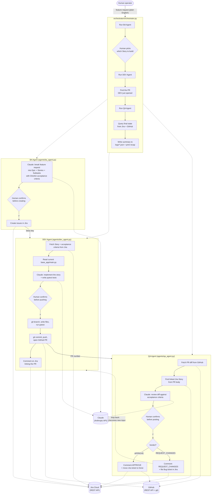

# Architecture

## Overview

This system automates one end-to-end feature cycle across three specialized
agents, coordinated either manually (running each agent script in sequence)
or via `orchestrator/orchestrator.py`. Each agent is a standalone Python
script with its own CLI entry point, calling Claude (Anthropic API) for
reasoning/generation and the Jira/GitHub REST APIs for real actions.

Every agent has a human-in-the-loop confirmation step before it writes,
pushes, or creates anything - nothing happens automatically without an
explicit `y` from the operator.

## Diagram

## Components

| Component | Responsibility | External calls |
|---|---|---|
| `base_app/main.py` | The product being built - a Typer CLI task manager | none (this is the target code, not a tool) |
| `agents/schemas.py` | Shared Pydantic models (`BAOutput`, `JiraStory`, etc.) so BA output has a validated shape | none |
| `agents/ba_agent.py` | Turns a feature request into Jira Epic/Stories/Subtasks with Gherkin ACs | Anthropic API, Jira API |
| `agents/dev_agent.py` | Implements a Story: writes code + tests, opens a PR | Anthropic API, Jira API, GitHub API, local git |
| `agents/qa_agent.py` | Reviews a PR against the linked Story's acceptance criteria | Anthropic API, Jira API, GitHub API |
| `orchestrator/orchestrator.py` | Chains the three agents, using Jira/GitHub APIs to hand off Story keys and PR numbers automatically, then queries final state and writes a summary log (`logs/*.json`) | Jira API, GitHub API (subprocess-invokes the three agent scripts) |

## Data flow between agents

BA Agent's output (Jira Story key) becomes DEV Agent's input. DEV Agent's
output (a GitHub PR whose body embeds a link back to the Story key) becomes
QA Agent's input - QA parses the Story key straight out of the PR body via
regex, so no separate handoff file or database is needed between agents.
When QA requests changes, the new Bug ticket it creates becomes a valid
input to the DEV Agent again, closing the loop (demonstrated live: TASK-29
went QA → DEV → QA → Done).

## Human-in-the-loop checkpoints

1. **After BA analysis, before Jira creation** - review the generated
   Epic/Stories/Subtasks and Gherkin criteria before anything is created.
2. **In the orchestrator, between BA and DEV** - a human picks which Story
   to build first (not automated - a deliberate prioritization decision).
3. **After DEV generates code, before branch/commit/push/PR** - review the
   proposed diff summary and commit/PR text.
4. **If generated tests fail** - DEV Agent explicitly warns and asks for a
   second confirmation before proceeding anyway.
5. **After QA reviews, before posting** - review the verdict and comment
   before it's posted to the PR and acted on in Jira.
